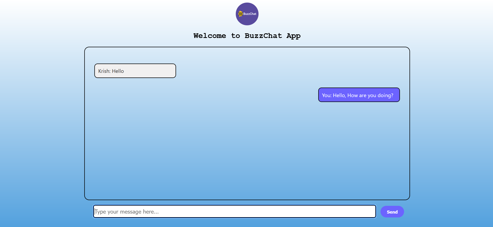

# 💬 BuzzChat - Real-Time Chat Application

BuzzChat is a simple, real-time chat application built using **Node.js** and **Socket.IO**. It allows users to join a chatroom and communicate live with other participants.



## 🚀 Features

- Real-time messaging with Socket.IO
- Responsive and clean UI with HTML, CSS
- Join/leave message notifications
- Typing indicators (if implemented)
- Client/server separation for scalability


## ⚙️ Installation & Setup

### Prerequisites
- Node.js installed on your machine

### Steps

1. **Clone the repository**
   ```bash
   git clone https://github.com/yourusername/buzzchat.git
   cd buzzchat
2. **Install dependencies**
   ```bash
   npm install
3. **Start the server**
   ```bash
   node index.js
4. Open in browser - Navigate to http://localhost:8000 in your browser.

🧠 How It Works

    The server uses Express.js and Socket.IO to handle WebSocket connections.

    When a client connects, they join a room and can send/receive messages.

    Messages are broadcast to all clients in real time.

    The client-side JavaScript (in client.js) listens for events like incoming messages and updates the DOM accordingly.

🛠️ Built With

    Node.js

    Socket.IO

    HTML/CSS/JavaScript

📌 Future Enhancements

    User authentication

    Private messaging

    Persistent chat history with a database

    Emoji support

🤝 Contributing

Pull requests are welcome. For major changes, please open an issue first to discuss what you would like to change.
📄 License

This project is open source and available under the MIT License.
